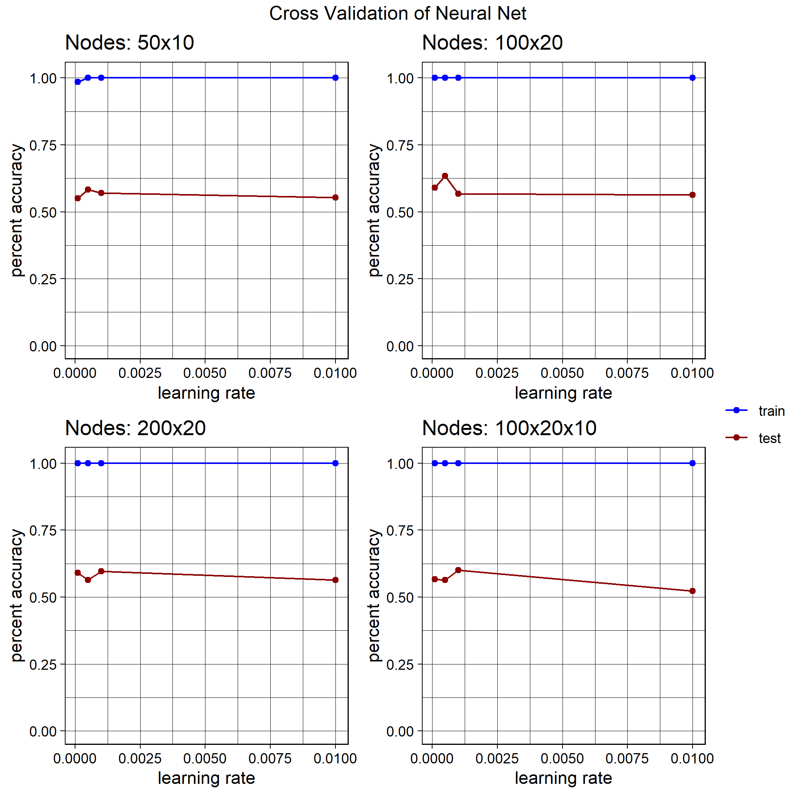

#SessionInfo

```{r}
sessionInfo()
```

**Note:** For my cross validation and visualization functions I added eval =F in order to save computation time in knitting. If you wish to test my code remove this line from gen_cross_mat and plot_testing code blocks. 

## Libraries:
```{r, warning=FALSE, message=FALSE}
library(tidyverse) # data manipulation
library(neuralnet)# neural net library
library(gridExtra) # for plot function
library(grid) # for plot function
library(knitr) # for kable()
library(made4) #data package
#library(Biobase)  # Bioconductor
library(genefilter)  # for rowVars() and other functions for feature selection.
library(beepr) #REMOVE BEFORE SUBMIT

```

## Functions:

In the previous homework I wrote functions that helped me cross-validate and what not so I added them here

```{r functions}

# I moved all my functions into an R script to be used by other scripts too!
# Functions Include: 
#   scale_data()
#   E_recode()
#   perc_acc()
source('neural_net_functions.R')

# Multiplot code!
#grid_arrange_shared_legend()
source('jacob_multiplots.R')

```

## Data import:

```{r clean_data_import, message=FALSE}

# Read in the cleaned expression data
expression <- as.data.frame((read.table("../data/clean_expression.txt", row.names=1 )))
rownames(expression)[1] <- '184A1'# Rename the only integer name

# Read in the subtype data
subtypes <- read_tsv("../data/clean_subtypes.txt")

# Read in the truth set
truth_set <-  as.data.frame((read.table("../data/clean_training_answers.txt", row.names=1 )))


##    Test set:
test_expr <- as.data.frame((read.table("../data/clean_test_expression.txt", row.names=1 )))
rownames(expression)[1] <- '184A1'# Rename the only integer name

# Read in the subtype data
test_subs <- read_tsv("../data/clean_test_subtypes.txt")


dim(expression)
dim(subtypes)
dim(truth_set)
#dim(featureSet)
```


## Analysis Plan:
___

I intend to use the neuralnet package in order to build my neural net model. 
This code is modified from my homework 5 assignment so I will added additional annotations and details describing how I built my network and explain each parameter used/optimized

Based on this paper [Canakoglu et al 2018](http://scholar.googleusercontent.com/scholar?q=cache:y3dVaZByUbYJ:scholar.google.com/&hl=en&as_sdt=0,38)
Canakoglu, Arif, et al. "Designing and Evaluating Deep Learning Methods for Cancer Classification on Gene Expression Data." Proceedings of CIBB 2 (2018): 1.

Here the paper is a benchmarking of different machine learning techniques. I will use their deep learning baseline of a Feed forward neural network as a starting point. The parameters are as follows:
  Feature selection: top 5000 most variant features
  normalization: min-max 
  activation funct: ReLu    (Not Used)
  Loss funct: Binary Cross Entropy
  hidden nodes: 2 layers of (100,20) 
  
  
I will use this framework to perform cross validation and build up to this implementation.
Based on the neuralnet documentation the ReLu function is not native so I will probably not use it. 
I do intend to use prescibed Cross Entropy loss function since it is apart of nueralnet()
I will use the same min max normalization as before in order to run my previous code and build into this framework. 


I will use the neuralnetwork to do multiple classification of all drugs in the dataset. I decided to do this approach as the alternative is to make 12 seperate neuralnets one for each drug and then merge their output into one matrix. This approach is valid as some drugs may be easier to predict than others allowing for a boost in percent accuracy. I will focus on optimizing a complex neuralnetwork to do multiple predictions to see if the model can still offer some predtive power.


### Post Fitting Info:
  
  
Originally my team decided to pick the most top 10 quantile to find the most variable genes, I then expanded into this 5000. 

Additionally I learned that the normalization and activation functions are dependent on each other. 
I have 2 function natively available, logistic and tanh.
logistic activation requires data to be between 0 and 1 (min-max scaling). Logistic activation suffers from inabillity to deeply propogate through a network when your netowrk becomes large. In full honesty I could not find any suorces on if a network with 100,20 hidden nodes will suffer from this. Based on that literal one class of Xubo's ML class she said it matter when you have hundreds of hidden layers so I am maybe fine?
tanh activation requires data between -1 and 1(min-max scaling rescaled). It does not suffer as many back propogation issues but traditional backpropogation does not operate as well so a different algorithm is such as RProp+. Resilent Backpropogation with backtracing is a modified backpropogation algortim that 

I tried to implement relu but it didnt work.... Relu requires data between 0 and 1. which is the min-max scaling
neuralnet requires the activation function to be derivable and I tried to follow a post references below but to no avail...
Additionally the ReLu approach has cons, specifically it is hard to train the neuralnet when you do not have enough observations and other optimization to minimize dead neurons.


## Feature Selection 
```{r}
# rowVars is in geneFilter package accepts data where every column is feature and computes variance of the features. 
expVar <- (rowVars(expression))
hist(expVar) # show histogram
expVar <- as.data.frame(expVar)
names(expVar) <- c('variance') # rename the column
expVar <- cbind(expVar, gene_name = rownames(expVar)) # append the rows for indexing

# Sort the variances 
descVar <- expVar %>% arrange(desc(variance)) 

#paste('max variance:', max(expVar[,1]))
#paste('min variance:', min(expVar[,1]))

# Show quantiles
qt <- quantile(expVar$variance, seq(0,1,by=0.1)) 
kable(qt)
```


90% of the training data contains a variance less than 1!!!! This indicates that these genes have low power in predicting response. 

Based on my NN method which can handle noisy data I will only include the top 10% variable features in the model. 


Following the referenced paper aboved I will also use the top 5000 most variable features


```{r subset_features}
# Top 10% most variant features subset. 
top_qar_idx <- expVar$variance > qt['90%']
#features.1 <- expression[quant_idx,] #This is 

# Lets take top 5000 

top5000 <- descVar[1:5000,'gene_name']
top5000_idx <- rownames(expression) %in% top5000
features.1 <- expression[top5000_idx,]


# Decided on 5000 genes
test.features <- test_expr[top5000_idx,]

dim(features.1)
```

Excellent we are now down to a relatively managable 1864 features when choosing a 10% cutoff.

I then went on to extract the top 5000 features. Through cross validation I saw that the 5000 features offer greater predictive power. I forgot to save figures showing this I will definitely implement a save function into my plots from now on. 


##  Data Normalization

Now applying Min-Max scaling to Data:

This is done due to the constraint of the logistic activation function bounded between 0-1.

```{r subset}
#Subset trainingdata

# Transpose dataset to Feature Set (so each column is a feature)
train <- data.frame(t(features.1))
# Now scale the data ( Min-Max scaling so output is bounded [0,1]
train <- scale_data(train)


##  Remains of me trying to implement ReLu
# Now rescaling data to be bounded between [-1,1] 
#train <- (2* train) - 1 

#train[1] %>% summary()

# Make dummy variables for subtype!
sub_fac <- as.factor(subtypes$subtype)

covar = as.numeric(sub_fac)


# Make matrix of the truth_set
classif <- truth_set
cls_vect <- names(classif)
pred <- noquote(paste( 'drug.', as.numeric(cls_vect), sep = ''))
names(classif) <- noquote(pred)# Now it can be parsed!


# Append Truthset AND SUBTYPES to Feature set 
ktrain <- data.frame(cbind(classif,covar,train))

names(ktrain) %>% head(13)
#
# Now look at it!
dim(ktrain)
head(ktrain[,1:5])


#Subset Testing Data
# Same thing
test.features <- data.frame(t(test.features))
test.features <- scale_data(test.features)
tsub_fac <- as.factor(test_subs$subtype)
tcovar = as.numeric(tsub_fac)

ktest <- data.frame(cbind(tcovar,test.features))
dim(ktest)
head(ktest[,1:5])
```

Now I will proceed to only touch the testing data only when I am fully testing a cross-validated model.


## Cross Validation: 


Now CROSS VALIDATING NN using k-fold cross validation with k = 5. This is done as that makes an even fold with 25 samples and coding became complex and I wanted to train my model. 


Here are some references to my understanding activation functions.

[tanh](https://towardsdatascience.com/activation-functions-and-its-types-which-is-better-a9a5310cc8f)

[apply custom relu](https://stackoverflow.com/questions/34532878/package-neuralnet-in-r-rectified-linear-unit-relu-activation-function)


So I decided, as the ceri et al. stated as their benchmark I used a relu approximation called the deverived softmax function. I can take no credit for this as the neuralnet package acts very interesting behind the scenes applying a derivation on the activation function. Normally the relu function cannot be directly derived in this way as the code for neuralnet is 100% incompatable with this. Thus I decided to use an approximated softmax function that can be tuned with parameter k. K reflect how well the approximation will follow the function, When a (i think) resonable k is used an error is generated stating the derivation matrix contains zero. This is expected when using relu but, he is made so i made an approximation. 

THis did not work the network doesnt converge :\

### Post Fitting Info Cross:

I explored multiple parameters begin at the learnign rate and number of nodes in one hidden layer. I then applied parameters near the goal of 100x20. The more complex architeture did offer a predictive boost. 

In order to be through I also modified the stepmax parameter. This is how many iterations the model will train on the data, if a value is too low it will fail to converge and crash out. It turns out that the default value offered the best preditions. I also explored the threshold and found the default .5 is Optimal.

I did attempt to use another algortihm besides traditional backpropogation. Through this I learned about the rprop+ algorithm. Resilient Backpropgation with weight tracking is similar to traditional backprop but only uses the sign of value to update the weights within the network. This allows for faster compute time as well as resilence to large outliers that would push the weights heavily when using the partial derivative whole. Ultimately this algorithm offered better train time and predictive power. 


```{r gen_cross_mat, eval = F}
k <- .01 # for softmax approx
soft_plus_appr <- function(x) {x/(1+exp(-2*k*x))} # Larger k means accurate approcimation but hard to dervive
soft_plus <- function(x) {log(1+exp(x))} # This didnt work too :(

set.seed(2019) #set the seed
n <- names(ktrain) #extract names to build formula
pr_names <- n[1:12]
f <- as.formula(paste( paste(pr_names, collapse = ' + ')  , paste(n[!n %in% n[1:12]], collapse = ' + '), sep = ' ~ '))


train_obs <- nrow(ktrain)
k <- 5
loops = floor(train_obs / k)
k_indexs <- sample(seq(train_obs)) #scamble the indexs in order to conduct k-fold
nss <- list(c(50,10),c(100,20),c(200,20),c(100,20,10))# range of hidden layer nodes to explore
ls <- c(.0001,.0005,.001,.01) # range of learning rates to explore
ls_len <- length(ls) # length of the learning rate, i made it same as nodes
zero_ls <- rep(0,ls_len) # empty zero vector to make R happy
train.acc.mat <- data.frame(zero_ls) #initalize to empty vector to make the raw matrix
test.acc.mat <- data.frame(zero_ls) # ^^^
train.pred.list <- list()
test.pred.list <- list()


# custom error function:

start_time <- Sys.time()

# Node amount loop (outter most loop)
for (s in seq(length(nss))){
  
  ns <- nss[[s]] #extract node number
  
  train.mult.acc <- data.frame(matrix(0,nrow=ls_len,ncol=12))
  test.mult.acc <- data.frame(matrix(0,nrow=ls_len,ncol=12))
  
  train.acc <- zero_ls # inilize the accuracy vectors
  test.acc <- zero_ls  # ^^^
  
  # Learning Rate Loop (middle loop)
  for (l in seq(ls_len)){
    lss <- ls[l] #extract the learning rate
    
    # Cross validation loop
    for (i in seq(loops)) {
      
      if (k == 1){
        k_in <- k_indexs[i] #Pull out the indexs from the shuffled vector
      } else {
        if (i == 1){
          str <- 1 # initalize start index
          stp <- k # initialize stop index
        }
        else{
          #4 fold cross validation I chose this way bc the math was easier
          str <- str + k 
          stp <- stp + k
        }
        
        # Check if stp is out of index 
        if (stp > train_obs){
          k_in <- k_indexs[str : train_obs]
        }
        else{
          k_in <- k_indexs[str:stp] #Pull out the indexs from the shuffled vector
        }
      }
      
      # Subsetting the trianing data 
      fold_cross <- ktrain[k_in,] # Cross validation test set
      fold_c_truth <- ktrain[k_in,1:12] # Cross validation test truth
      fold_train <- ktrain[-k_in,] # Cross-V training data
      fold_t_truth <- ktrain[-k_in,1:12] # Cross-V training truth
    
      #Note: The ns can be made into multiple layers by c(layer1,layer2)

                       
      # Do the THING!               
      # CHECK THE ALGORRITHM, 
      nn <- neuralnet(f,data=fold_train, hidden=ns, threshold = .05,
                      learningrate = lss,  err.fct = 'ce', algorithm = 'rprop+',
                       linear.output = F)
      
      
      # compute train predictions
      train.pr <- neuralnet::compute(nn,fold_train[,2:ncol(fold_train) ])
      train_result <- round(train.pr$net.result)
      
      # find train accuracy and append to vector
      # Note! train.a is now a vector not a single value
      train.a <- perc_acc(train_result, fold_t_truth,loops) #11 cross validation loop ave
      train.mult.acc[l, ] <- train.mult.acc[l, ] + train.a 
      train.acc[l] <- train.acc[l] + mean(train.a)
    
      #compute test preditctions
      test.pr <- neuralnet::compute(nn,fold_cross[,2:ncol(fold_cross)])
      test_result <- round(test.pr$net.result)
      
      #find test accuracy and append to vector
      test.a <- perc_acc(test_result,fold_c_truth,loops) #11 cross validation loop ave
      
      test.mult.acc[l, ] <- test.mult.acc[l, ] + test.a 
      test.acc[l] <- test.acc[l] + mean(test.a)
      
     
  }
  }
  # add the accuracy vectors to their matrixes
  train.acc.mat <- cbind(train.acc.mat,train.acc) 
  test.acc.mat <- cbind(test.acc.mat,test.acc)
  train.pred.list <- c(train.pred.list, train.mult.acc)
  test.pred.list <- c(test.pred.list, test.mult.acc)
  beep(2)

}

# Drop the intializing null row. 
train.acc.mat <- train.acc.mat[,2:ncol(train.acc.mat)]
test.acc.mat <- test.acc.mat[,2:ncol(test.acc.mat)]

# Now assemble the final matrix with merging
final_matrix <-  data.frame(learning_rate = ls)

# object for mat_zip to label columns for plotting 
id_list <-  list( nodes= nss, keys= c('train_nodes_', 'test_nodes_'))

# zip together the two columns with names 
organized_matrix <- mat_zip(train.acc.mat, test.acc.mat, id_list)

# Append to final matrix to be passed to plotting
final_matrix <- cbind( final_matrix, organized_matrix)

end_time <- Sys.time()

end_time - start_time

beep(5)
```


Again here is my source for plots.
first and foremost I found some code that plots a common legend on the ggplot2 github: [link](https://github.com/tidyverse/ggplot2/wiki/Share-a-legend-between-two-ggplot2-graphs)

At the top I sourced the script 


Please disregrad the empty plot I cant figure out the bug....
```{r plot_testing, eval=F}
# Get the labels for axies
names <- names(final_matrix)

# I CATCH THE LEARNING RATE HERE BC ITS EASY!!!! THE NAME IS NEEDED FOR aes_string(). 
lr <- names[1] #THis is the learning rate so the parameter

###       Modifying matrix to have the darn colors

# Makes a vector the size of the rows in matrix for plotting
train_ <- rep('train',length(final_matrix[,2]))
test_<-  rep('test',length(final_matrix[,3]))

# Massage two vectors into data.frame for cbind
color_factors  <- data.frame(train_,test_)
# double bam
plot_organized_matrix <- cbind(color_factors,final_matrix)


# Get names for all columns in the matrix. 
names <- names(plot_organized_matrix)
len_n <- length(names) # length tells you how far to go 

### BEWARE: I added the colors and learning rate to the matrix and theres the full dataset after. 
### basically start the sequence when the repetions happen, and its gotta be this way bc its easy if they are in one matrix

ggpls <- list() # Initialize gorb object list. 


# Loop over entire matrix length
####  BEWARE: Its happening!
data_start <- 4
for (i in seq(data_start,len_n,2)){
  
  # Two names of the sequenctial columnes
  train_n <- names[i]
  test_n <- names[i+1]
  
  nod <-  strsplit(train_n, split='_')[[1]][3] # Find the node about I arbitrariy chose train_n
  
  # Assemble the BOY! gorb is what the data object is called? idk cs people need to chill
  gorb <- ggplot(plot_organized_matrix) + 
    # Plot the training outcomes
    geom_point(aes_string(x=lr, y=train_n, color = 'train_')) +
    geom_line(aes_string(x=lr, y=train_n,color = 'train_')) +
    # Plot the test outcomes
    geom_point(aes_string(x=lr, y=test_n, color = 'test_')) +
    geom_line(aes_string(x=lr, y=test_n, color = 'test_')) +
    # Now scale the figure (the baby one to be stitched)
    xlim(min(ls),max(ls)) + ylim(0,1.01 ) +
    #I think this forces the colors to happen!!!!!
    scale_color_manual('',
                       # Must match the names in the color section of the matrix (YO CATCH THE NAMES NEXT TIME)
                       breaks= c('train','test'),
                       # Values can be a list of any ggplot color (THINK HTML)
                       values = c('darkred','blue')) +
    #guides(color=FALSE) + # This hides the legends but i found a function that does it
    theme_linedraw() + # Pretty
    # Label the plots (again the babies)
    xlab('learning rate') + ylab('percent accuracy') + 
    labs(title=paste('Nodes:',nod)) 
    
  # append to list yay!
  ggpls <- c(ggpls,list(gorb))
} 
  
  
# Make list of grobs as output from the loop
title <- 'Cross Validation of Neural Net'
val_plot <- grid_arrange_shared_legend(ggpls, ncol=2,nrow=2, position = 'right', title)
ggsave('gutierrez_100_20.png',val_plot)
```

Due to the compute time of cross validation I simply added the attached plot here



This output shows that the hidden nodes 100x20 offers the best preditive power in relation to train and test accuracy. Most of these models do not perform well getting accuracy around 50%. This is to be expected when dealing with a small dataset as only specific architetures will do well in classfification.


### OPTIMAL PARAMETERS:

Feature selection: top 5000 most variant features
normalization: min-max 
activation funct: Logistic
Loss funct: Binary Cross Entropy
hidden nodes: 2 layers of (100 200
learning rate: .0005
Threshold = .05
Stepmax = 1e+05


Through cross validation this combination of parameters appears to be the best of the best I looked at...


But, lets find out!

___

using the optimal parameters found during cross-validation

```{r apply_optimal}

set.seed(2019)
pn <- names(ktrain) #extract names to build formula
                 
pr_names <- pn[1:12]

f <- as.formula( paste( paste(pr_names, collapse = ' + ')  , paste(pn[!pn %in% pn[1:12]], collapse = ' + '), sep = ' ~ '))

nn <- neuralnet(f,data=ktrain, hidden=c(100,20), threshold = .05, act.fct = 'logistic',
                      learningrate = .0005,  err.fct = 'ce', algorithm = 'rprop+',
                       linear.output = F)

beep(5)


# compute train predictions
train.pr <- neuralnet::compute(nn,ktrain[,13:ncol(ktrain)])
train_result <- round(train.pr$net.result)

# find train accuracy and append to vector
train.acc <- perc_acc(train_result, ktrain[,1:12])


  #compute test preditctions
test.pr <- neuralnet::compute(nn,ktest)
test_result <- test.pr$net.result

# test_result is final data to ssubmit to kaggle 
test_result
```
 


Neat!!! Now lets submit to kaggle.

Now cleaning result data to submit to kaggle:
```{r}
test_result <- test.pr$net.result
cls_vect <- names(truth_set)
colnames(test_result) <- as.vector(cls_vect)
rownames(test_result)[1] <- '600MPE' 

# Now reading in the data and merging into kaggle form.
kaggle_submit <- read_csv('../data/scoring_and_test_set_id_mappings.csv')

# Get order of kaggle_submit

cell_line_order <- kaggle_submit %>% arrange(drug) %>% pull(cellline)
drug_order <- kaggle_submit %>% distinct(drug) %>% pull()
kag_cell_order <- cell_line_order[1:14]


test_result <- test_result[ kag_cell_order, ]
# Now cleaning names
drugnames <- colnames(test_result)
colnames(test_result) <- gsub('.','-',drugnames, fixed = T)


kaggle_test <- cbind(cellline = rownames(test_result),test_result)
kaggle_test <- as_tibble(kaggle_test)

to_join_kag <- kaggle_test %>% gather('drug','value', -cellline)

kaggle_submit <- left_join(kaggle_submit,to_join_kag)

kaggle_submit <-  kaggle_submit %>% mutate(value = format(as.double(value), digits = 10))

# Now reorder kaggle_submit
kaggle_submit %>% arrange(id)

kaggle_submit %>% head()


# Now extracting just id and prediciton
kag_to_write <- kaggle_submit %>% select(id,value)

write_csv(kag_to_write,'gutierrez_sub_2.csv')

```


After submitting to kaggle this model recieved A test accruacy of 58.1% This is about what I expected looking at the cross validation. 

Overall I am pleased with my implementation of a neural net. I have shown that thorugh optimization the model performs remarably consistent with the cross validation estimates. Although this model is not the best I believe that it could be improved upon by having access to more training data. 


